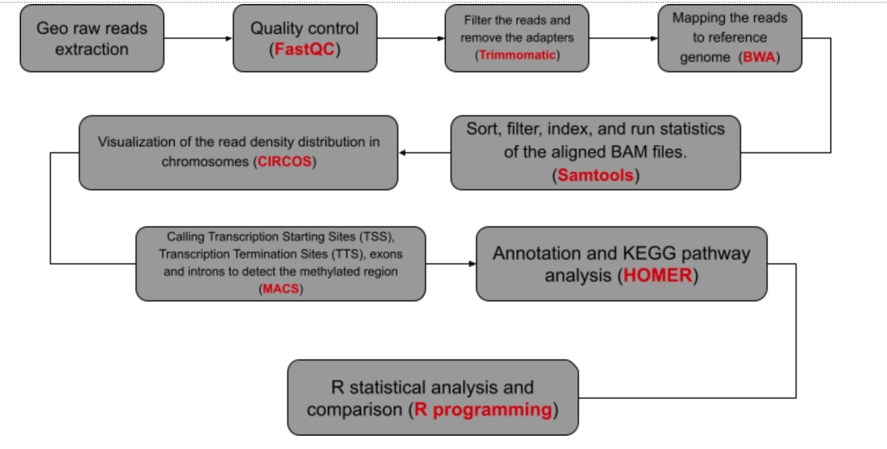

# MethyloMining- A simple exploration to multiple human methylation profile in diffrent cases.
 

  

## Background
### DNA Methylation
DNA methylation is a conserved epigenetic mark that regulates multiple processes, including gene expression, genome stability and gene imprinting, and consequently disruption of DNA methylation can lead to developmental abnormalities. It is one of the most commonly occurring epigenetic events taking place in the mammalian genome. This change, though heritable, is reversible, making it a therapeutic target.
### Human DNA methylation
Alterations in DNA methylation are common in a variety of tumors as well as in development. Of all epigenetic modifications, hypermethylation, which represses transcription of the promoter regions of tumor suppressor genes leading to gene silencing, has been most extensively studied. However, global hypomethylation has also been recognized as a cause of oncogenesis.
## Our Objective
For well understanding the methylomics, many DNA methylation markers have been identified. However, few studies, if any, have tried to find DNA methylation markers to diagnose diverse cancer types simultaneously. In this study, we tried to identify common DNA methylation markers by comparing methylation profiles from different cancer datasets.
## General workflow
 
## Data acquisition
All data was downloaded from the [National Center of Biotechnology Informarions's](https://www.ncbi.nlm.nih.gov/) [Gene Expression Omnibus](https://www.ncbi.nlm.nih.gov/geo/) database.
## Analysis pipeline

## System/ Software prerequisites 
### System requirement
- [ ] R programming language ([What is R?](https://www.r-project.org/about.html))
### Softwares
- [ ] [FastQC](https://www.bioinformatics.babraham.ac.uk/projects/fastqc/)
- [ ] [Trimmomatic](http://www.usadellab.org/cms/uploads/supplementary/Trimmomatic/TrimmomaticManual_V0.32.pdf)
- [ ] Burrows-Wheeler Aligner ([BWA](http://bio-bwa.sourceforge.net/))
- [ ] [Samtools](http://www.htslib.org/)
- [ ] [Circos](http://circos.ca/)
- [ ] Model-based Analysis for ChIP-Seq ([MACS](https://github.com/macs3-project/MACS))
- [ ] Hypergeometric Optimization of Motif EnRichment ([HOMER](http://homer.ucsd.edu/homer/))
## Validation
OncoMethyla was validated using the following datasets:
- Covid-19: [GSE113432](https://www.ncbi.nlm.nih.gov/bioproject/451165)
- Smoking: [GSE153636](https://www.ncbi.nlm.nih.gov/bioproject/643525)
- Mild Cognitive disorder: [GSE136986](https://www.ncbi.nlm.nih.gov/bioproject/564224)
## Team members
- [Sofia Sehli.](https://github.com/SofSei) Phd candidate, Mohammed VI University of Health Sciences of Casablanca. Morocco.
- [Abdellah Idrissi Azami.](https://github.com/abdellahai) Phd candidate, Mohammed VI University of Health Sciences of Casablanca. Morocco.
- [Nihal Habib.](https://github.com/NihalHB) Phd candidate, Mohammed VI University of Health Sciences of Casablanca. Morocco.
- Douae El Ghoubali. Phd candidate, Mohammed VI University of Health Sciences of Casablanca. Morocco.
- [John Njogu.](https://github.com/jnnjogu) Bioinformatics Research intern, International Centre of Insect Physiology and Ecology. Kenya.
