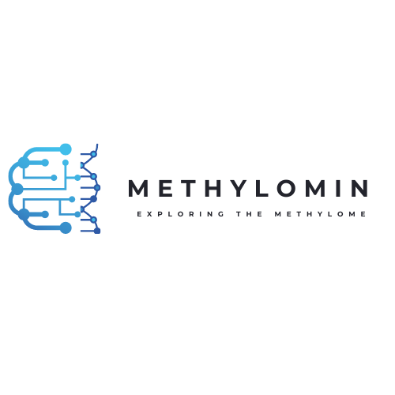
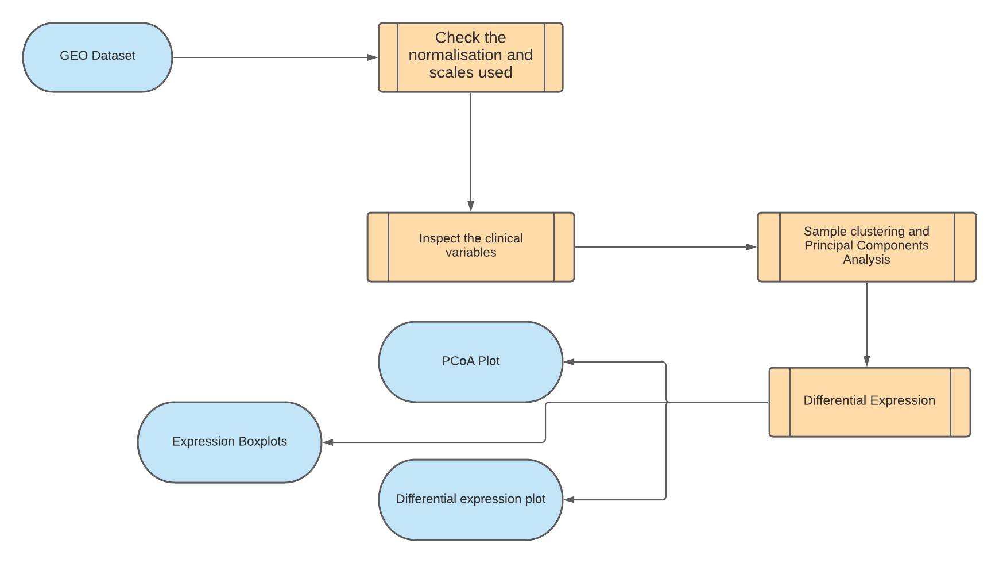

# MethyloMin- A simple exploration to multiple human methylation profiles in different cases.
 

  

## Background
### DNA Methylation
DNA methylation is a conserved epigenetic mark that regulates multiple processes, including gene expression, genome stability, and gene imprinting, and consequent disruption of DNA methylation can lead to developmental abnormalities. It is one of the most commonly occurring epigenetic events taking place in the mammalian genome. This change, though heritable, is reversible, making it a therapeutic target.
### Human DNA methylation
Variation of DNA methylation is a common result in a variety of human body statuses. Of all epigenetic modifications, hypermethylation or hypermethylation might affect the expression of different genes, the organism's body usually uses this process to adapt to different environmental states. Studies have been done in order to discover methylation profiles for different cases, but none was trying to explore multiple cases profiles.
## Our Objective
In this project, we try to compare the methylation profiles of different human statuses in order to have a big overview of the involvement of methylation in different processes
## Data acquisition
All data was downloaded from the [National Center of Biotechnology Informarions's](https://www.ncbi.nlm.nih.gov/) [Gene Expression Omnibus](https://www.ncbi.nlm.nih.gov/geo/) database.
## Analysis pipeline

## System/ Software prerequisites 
### System requirement
- [ ] R programming language ([What is R?](https://www.r-project.org/about.html))
### Packages
- [ ] [GEOQuery](https://www.bioconductor.org/packages/release/bioc/html/GEOquery.html)
- [ ] [GGplot2](https://ggplot2.tidyverse.org/)
- [ ] [LIMMA](https://bioconductor.org/packages/release/bioc/html/limma.html)
## Datasets
Methylomin was tested using the following datasets:
- Covid-19: [GSE174818](https://www.ncbi.nlm.nih.gov/bioproject/PRJNA732198)
- Smoking: [GSE147040](https://www.ncbi.nlm.nih.gov/bioproject/PRJNA612837)
- Mild cognitive impairment: [GSE190540](https://www.ncbi.nlm.nih.gov/bioproject/PRJNA787538)
- Oculo-auriculo-vertebral spectrum: [GSE152204](https://www.ncbi.nlm.nih.gov/bioproject/PRJNA638638)
## Team members
- [Sofia Sehli.](https://github.com/SofSei) Phd candidate, Mohammed VI University of Health Sciences of Casablanca. Morocco | Project leader.
- [Abdellah Idrissi Azami.](https://github.com/abdellahai) Phd candidate, Mohammed VI University of Health Sciences of Casablanca. Morocco | Tech co-Leader.
- [Nihal Habib.](https://github.com/NihalHB) Phd candidate, Mohammed VI University of Health Sciences of Casablanca. Morocco | Writing co-Leader.
- Douae El Ghoubali. Phd candidate, Mohammed VI University of Health Sciences of Casablanca. Morocco.
- [John Njogu.](https://github.com/jnnjogu) Bioinformatics Research intern, International Centre of Insect Physiology and Ecology. Kenya.

